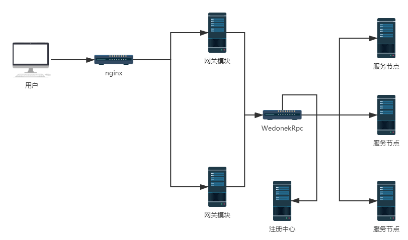

# WedonekRpc
## 简要说明
   是一个微服务集成框架，使用TCP协议作为对内服务节点的通讯协议，使用http协议作为对外提供服务的协议，集成了：日志，配置管理，消息的广播和订阅，RPC远程调用，远程锁，负载均衡，分布式事务，登陆授权，API网关，IOC容器，身份标识，链路跟踪等功能。
   
   注：RPC模块为一个通讯组件集成在每个节点服务和网关上
## 使用帮助文档
   使用，各组件的详细说明和安装部署详见：[框架说明](Doc/框架说明.docx)。
## 运行环境
 运行环境：.net core 5.0。
  
 数据库：SQL SERVER。
## 配置项
[完整配置文件](file/LocalConfig.json)。
## 基础组件
### 配置中心
支持配置同步更新。
### 异常处理
框架提供了一套标准的处理模型：  
1，会自动记录来自程序域中未经处理的异常并写入日志。  
2，自动隐藏 内部详细错误 并返回标准错误消息。  
3，对异常信息统一管理和本地化。  
### 日志
日志级别：trace ,info，debug，warn, error和critical。  
日志分组：根据所属系统类别将日志分文件夹存储。  
统一存储：支持将指定级别范围内的错误或信息日志上报，并存储在DB中。  
邮件通知：支持将指定级别范围内的错误或信息日志通过Email发送。  
属性扩展：支持自定义属性。  
### 消息广播和订阅
提供各服务之间的广播和订阅服务。  
使用场景：本地缓存刷新等。  
广播范围：1，服务集群。2，服务组。3，服务类别。4，指定服务。5，所有服务，6区域。  
发送方式：通过实体Model标记(IRemoteBroadcast)特性的方式。  
订阅：订阅消息的接收方需继承接口：IRpcSubscribeService，类中的方法则为订阅的事件。  
注意事项：消息广播和订阅不支持数据返回。  
### 消息发送
通过在通讯实体Model上标记(IRemoteConfig)特性的方式进行配置。

###消息的接收
1，新建一个专门用于接收远程消息的类。  
2，在该类标记“RpcRouteGroup”特性或继承IRpcApiService 接口。  
3，该类中符合约定规范的方法会被自动识别为有效暴露的接口方法。  
4，如需对类中的方法重命名可在方法上标记 “RpcClient.Attr.RpcTcpRouteAttr” 特性。  
5，接收的方法名全局唯一。  
6，如需使用对象容器需使用继承IRpcApiService 接口的方式注册。  

### 客户端身份标识
1，可看做租户。  
2，标识客户端身份和检查客户端调用资源的权限。  
3，资源类型分为网关API接口和RPC消息接口资源。  

### 远程锁
隔离级别：按照业务请求隔离。  
锁类型：  
1，	同步锁：只允许一个请求执行，在设定时间范围(秒)内相同请求会返回第一个请求的结果。  
2，	排斥锁：只允许一个请求执行，其它不是相同节点服务的请求返回错误。  
3，	普通锁：只允许一个请求执行，第一个请求执行期间内的其它请求在第一个请求执行结束时返回相同的执行结果。  
注：同步锁和普通锁 的区别生命周期不同。  

### 负载均衡
负载均衡的方式分为2类 全局负载和请求负载。  
全局负载支持：单例，平均，权重，平均响应时间，先权重在随机和随机。
请求负载支持：HashCode，数值范围，固定值和ZoneIndex(=ascii(首字节)|ascii(尾字节))

### 分布式事务
1，事务作用域为线程，事务内跨线程操作会丢失事务。  
2，RPC消息，订阅消息和广播消息支持进行事务操作。  
3，事务范围可以在声明事务时通过：RpcModel.TranLevel 设置（默认：RPC消息）。  
4，事务采取类似DTS的方案 只存在：（提交-回滚）。  
5，回滚方法实现需要检查重复。  
6，需手动在服务节点启动时注册本节点支持事务的消息和对应回滚的方法。  
#### 一致性说明
RPC消息采用的同步返回的方式保证了事务发起者可以获得及时的反馈。  
RPC消息接收节点会先记录日志在执行业务代码。  
消息的广播和订阅采用RabbitMQ确认模式保证数据的到达。  
消息的广播和订阅组件会自动为业务代码声明一个子事务。  
事务发起者如果在事务中出现不可用的状态事务协调器会在事务超时时间过后进行回滚。  
如业务过程中因消息的广播和订阅是异步消息和不能明确最终执行的数量，事务发起者需手动干预或协调器自动进行超时确认的方式处理。

### 登陆授权状态保存
使用场景：1，用户登陆状态保持 2，授权状态保持。  
保存方式：Memcached或Redis，根据Rpc基础服务设定的缓存类型定。  
是否支持单点：是。  
权限检查：支持。  
授权模块与网关集成，使用者只需关注用户状态值的注册和授权状态的添加。
### 验证组件
 验证组件是在 MVC验证扩展而来。  
需应用：System.ComponentModel.DataAnnotations 和 RpcHelper。  
验证组件可以剥离框架单独使用。  
支持：空验证，长度验证，检查验证状态，两个属性间数据比对，指定外部方法进行验证操作，指定内部方法验证，枚举类型验证，数据格式验证，正则表达式验证，数字类型关系验证，数字范围检查，两个时间的关系验证，时间范围验证和区域数据验证。

### 缓存组件
支持：本地缓存，Redis和Memcached。   
支持动态切换缓存方式，而无需更改代码。  
支持缓存版本控制。  
做了统一调用封装。  
除了基本的缓存使用外，对Redis 功能做了一定的封装。
### 本地任务
时间间隔：最小间隔到秒。  
任务执行方式：间隔执行(已添加时间开始)，定时执行和定时间隔（已当天0点开始计算 例：设定1小时间隔就是没一小时整点执行）。  
### 远程任务
任务已独立的进程运行。  
支持的调用方式：通过消息事件，HTTP和广播订阅。

### API网关
已模块的方式管理，支持WebSocket。

### IOC容器
1，框架会自动注册，用户无需关注。  
2，使用的第三方：unity。  
3，默认生命周期：瞬态生命周期（TransientLifetimeManager）。  
4，IOC 容器接口：IUnityCollect。  

### 对象映射
使用第三方：EmitMapper。  
做了Ling扩展 使用需应用：RpcClient。

### 链路跟踪
集成了：Zipkin